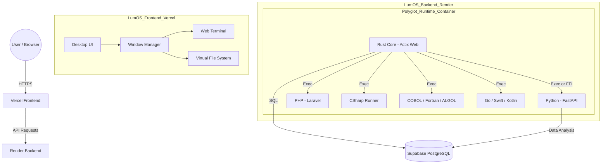

# LumOS

An OS that can be run in a browser derived from [Lumos Language](https://github.com/Uchida16104/Lumos-Language).

## Architecture



---

## Project Setup Guide & Complete Code

### File Structure and Directory Layout

This structure functions as a single repository (Monorepo).

```text
lumos-os/
├── .gitignore
├── README.md
├── vercel.json              # Vercel configuration
├── render.yaml              # Render configuration
├── package.json             # Frontend dependencies
├── tsconfig.json
├── tailwind.config.ts
├── postcss.config.mjs
├── next.config.mjs
├── public/
│   └── icons/               # Icon resources
├── src/
│   ├── app/
│   │   ├── layout.tsx       # Loads HTMX, Alpine, etc.
│   │   ├── globals.css      # Tailwind Import
│   │   └── page.tsx         # LumOS desktop core
│   └── lib/
│       └── utils.ts
├── backend/                 # Render root directory
│   ├── Cargo.toml           # Rust dependencies
│   ├── src/
│   │   └── main.rs          # Rust server entry point
│   └── runtimes/            # Storage for each language's runtime scripts
│       ├── python/
│       ├── cobol/
│       └── ...
└── .env.example

```
